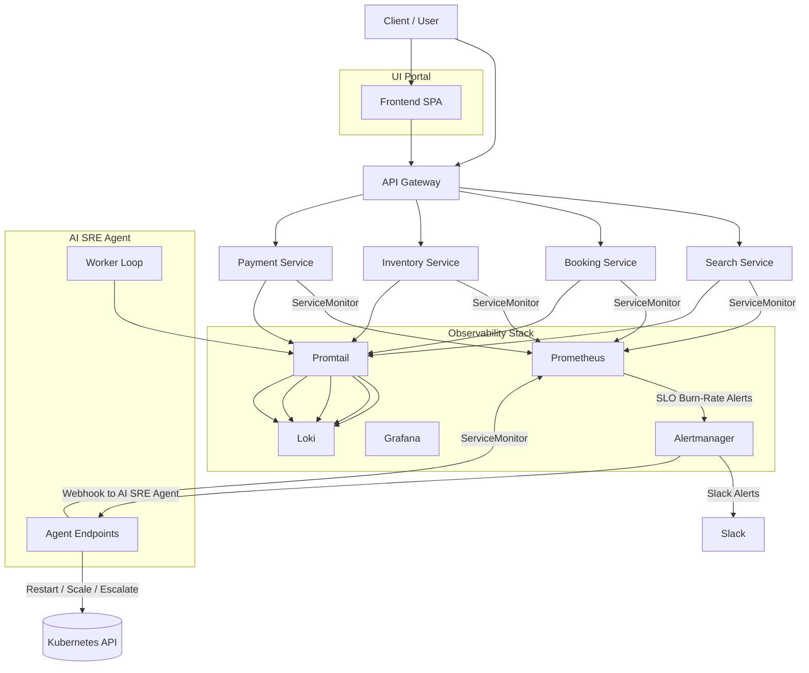

# 🚀 AI SRE Agent Platform  
### Kubernetes‑native, fully observable, self‑healing microservice platform

---

# 📘 Overview

The **AI SRE Agent Platform** is a Kubernetes‑native, SRE‑focused microservice ecosystem designed to demonstrate **how modern reliability engineering is done in production**.

It includes:

- A complete microservice architecture  
- A UI portal for platform visibility  
- A full observability stack (Prometheus, Grafana, Loki, Promtail)  
- SLOs, error budgets, burn‑rate alerts  
- Slack alerting  
- Auto‑remediation workflows  
- GitOps‑ready manifests  
- A fully instrumented AI SRE Agent capable of analyzing incidents and self‑healing  

This project is intentionally compact but architected like a **real enterprise‑grade platform**.

---

# 🧠 High‑Level Architecture

---

# 🔥 Key Features

## 1. Multi‑Service Kubernetes Platform  
Includes:

- API Gateway  
- Booking Service  
- Inventory Service  
- Payment Service  
- Search Service  
- UI Portal  
- AI SRE Agent  

Each service includes:

- TypeScript code  
- Dockerfile  
- Deployment  
- Service  
- ServiceMonitor  
- Structured logging  
- Prometheus metrics  

---

## 2. Full Observability Stack

### Prometheus
- Scrapes all services  
- Evaluates SLO recording rules  
- Computes burn‑rates  
- Powers dashboards and alerting  

### Alertmanager
Routes alerts to:

- Slack  
- AI SRE Agent `/remediate` webhook  

### Grafana
Dashboards included:

- Platform Overview  
- AI SRE Agent Dashboard  
- AI SRE Agent SLO Dashboard  
- Per‑service dashboards  
- Service template dashboard  

### Loki + Promtail
- Centralized logs  
- Queryable in Grafana  
- Structured JSON logging  

---

# 🎯 SLOs & Error Budgets

The AI SRE Agent enforces two SLOs:

### Availability SLO
- 99% success rate  
- Based on jobs_processed_total  

### Latency SLO
- 95% of jobs under 1.5s  
- Based on job_duration_seconds_bucket  

### Burn‑Rate Alerts

| Window | Threshold | Purpose |
|--------|-----------|---------|
| 5m     | > 14×     | Fast burn (restart) |
| 30m    | > 3×      | Slow burn (scale to 2) |
| 30m    | > 3× for 30m | Persistent burn (scale to 3) |
| 2h     | > 1×      | Human escalation |

---

# 🤖 Auto‑Remediation Engine

The AI SRE Agent exposes:

/health  
/metrics  
/analyze/incident  
/remediate  

Alertmanager POSTs alerts to `/remediate`.

### Remediation Actions

| Burn Type | Action |
|-----------|--------|
| Fast burn | Restart deployment |
| Slow burn | Scale to 2 replicas |
| Persistent burn | Scale to 3 replicas |
| Long burn | Human escalation |

### Slack Notifications

⚠️ Sustained burn — scaling ai-sre-agent to 2 replicas  
🔥 Persistent burn — scaling ai-sre-agent to 3 replicas  
🚨 Long burn — human intervention required  

---

# 🖥 UI Portal

A frontend SPA providing:

- Service health overview  
- SLO dashboards  
- Error budget visualization  
- Deployment version info  
- Incident analysis viewer  
- Integration with the AI SRE Agent  

Runs inside the platform namespace.

---

# 📂 Repository Structure

.
├── README.md
├── docs
│   ├── apis.md
│   ├── architecture-diagram.md
│   ├── architecture.md
│   ├── auto-remediation.md
│   ├── platform-overview.md
│   └── slo.md
├── infra
│   ├── argocd
│   │   └── applicationset-platform.yaml
│   ├── k8s
│   │   ├── namespaces
│   │   │   └── platform.yaml
│   │   └── platform
│   │       ├── ai-sre-agent
│   │       ├── api-gateway
│   │       ├── booking-service
│   │       ├── inventory-service
│   │       ├── payment-service
│   │       ├── search-service
│   │       └── ui-portal
│   └── observability
│       ├── alertmanager
│       ├── grafana-dashboards
│       ├── prometheus-rules
│       ├── prometheus-values.yaml
│       ├── loki-values.yaml
│       └── promtail-values.yaml
├── services
│   ├── ai-sre-agent
│   ├── api-gateway
│   ├── booking-service
│   ├── inventory-service
│   ├── payment-service
│   ├── search-service
│   └── ui-portal
└── shared
    ├── config.ts
    ├── http.ts
    ├── logger.ts
    ├── metrics.ts
    └── types.d.ts
    
---

# 🧪 What’s Fully Implemented

- ✔ AI SRE Agent worker  
- ✔ Metrics instrumentation  
- ✔ Prometheus scraping  
- ✔ SLO recording rules  
- ✔ Burn‑rate alerts  
- ✔ Alertmanager routing  
- ✔ Slack notifications  
- ✔ Auto‑remediation (restart + scale + escalate)  
- ✔ Grafana dashboards  
- ✔ Loki + Promtail logging  
- ✔ UI Portal  
- ✔ GitOps‑ready manifests  

---

# 🔮 Roadmap

### Short‑Term
- Rate‑limited remediation  
- Cooldown windows  
- Canary remediation  
- Synthetic monitoring  

### Medium‑Term
- CI/CD pipeline  
- Full GitOps automation  
- Load testing + chaos engineering  

### Long‑Term
- Multi‑cluster federation  
- Predictive scaling  
- AI‑driven anomaly forecasting  

---

# 🚀 Deployment

### 1. Apply namespaces
kubectl apply -f infra/k8s/namespaces

### 2. Deploy platform services
kubectl apply -f infra/k8s/platform

### 3. Deploy observability stack
kubectl apply -f infra/observability

### 4. Deploy AI SRE Agent
kubectl apply -f infra/k8s/platform/ai-sre-agent

---

# 👤 Author

**Franklin Ajero**  
Senior SRE / DevOps Engineer  
Kubernetes • Observability • Reliability Engineering  

---

# ⭐ Why This Project Matters

This platform demonstrates **real‑world SRE engineering**:

- Metrics  
- SLOs  
- Burn‑rates  
- Alerting  
- Dashboards  
- Auto‑remediation  
- Kubernetes  
- Observability  
- GitOps  

It is a **portfolio‑grade**, **interview‑ready**, **production‑style** SRE platform showcasing modern reliability engineering at a senior level.
