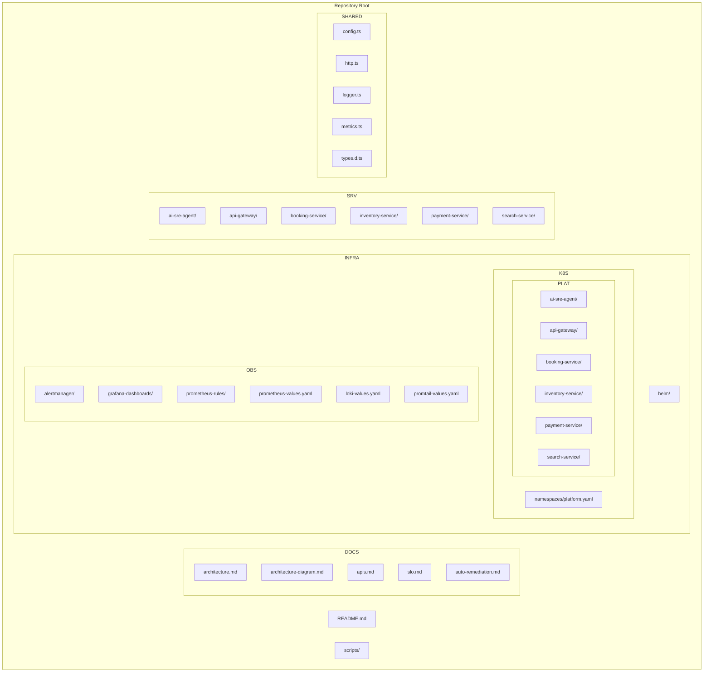

# Architecture Diagram

This document provides a high‑level and detailed view of the platform
architecture, including microservices, observability stack, namespaces, and the
AI SRE Agent auto‑remediation loop.

---

## 1. High‑Level System Architecture (Mermaid)

```mermaid
flowchart TD

    %% Clients
    A[Client / User] --> B[API Gateway]

    %% API Gateway routes
    B --> C1[Search Service]
    B --> C2[Booking Service]
    B --> C3[Inventory Service]
    B --> C4[Payment Service]

    %% AI SRE Agent
    subgraph SRE[AI SRE Agent]
        S1[Worker Loop<br/>Anomaly Scan Jobs]
        S2[/metrics<br/>/health<br/>/remediate]
    end

    %% Observability Stack
    subgraph OBS[Observability Stack]
        P[Prometheus]
        AM[Alertmanager]
        G[Grafana]
        L[Loki]
        PT[Promtail]
    end

    %% Metrics flow
    C1 -->|ServiceMonitor| P
    C2 -->|ServiceMonitor| P
    C3 -->|ServiceMonitor| P
    C4 -->|ServiceMonitor| P
    S2 -->|ServiceMonitor| P

    %% Logs
    C1 --> PT --> L
    C2 --> PT --> L
    C3 --> PT --> L
    C4 --> PT --> L
    S1 --> PT --> L

    %% Alerts
    P -->|SLO Burn‑Rate Alerts| AM
    AM -->|Slack Alerts| SL[Slack Channel]
    AM -->|Webhook /remediate| S2

    %% Auto‑Remediation Loop
    S2 -->|Restart / Scale| K8S[(Kubernetes API)]
```

---

## 2. Kubernetes Namespace Layout

All platform services run in the **`platform`** namespace:

```
infra/k8s/platform/
├── ai-sre-agent
├── api-gateway
├── booking-service
├── inventory-service
├── payment-service
└── search-service
```

Observability components run in the **`observability`** namespace:

```
infra/observability/
├── alertmanager
├── grafana-dashboards
├── prometheus-rules
├── prometheus-values.yaml
├── loki-values.yaml
└── promtail-values.yaml
```

---

## 3. Detailed Project Structure Diagram (Mermaid)

This diagram mirrors your actual repo tree and shows how components relate.



---

## 4. Component Responsibilities

### **API Gateway**
- Entry point for all client traffic  
- Routes requests to backend services  
- Exposes metrics for Prometheus  

### **Microservices**
Each service follows the same structure:

- `src/index.ts` — main HTTP server  
- `Dockerfile` — container build  
- `deployment.yaml` — Kubernetes deployment  
- `service.yaml` — Kubernetes service  
- `servicemonitor.yaml` — Prometheus scraping  

### **AI SRE Agent**
- Background worker loop  
- `/metrics` endpoint for Prometheus  
- `/remediate` endpoint for Alertmanager  
- Executes auto‑remediation actions  
- Sends Slack notifications  

### **Observability Stack**
- Prometheus scrapes metrics  
- Alertmanager routes alerts  
- Grafana visualizes dashboards  
- Loki + Promtail handle logs  

---

## 5. Auto‑Remediation Loop (Summary)

1. Prometheus detects SLO burn‑rate violations  
2. Alertmanager sends alert → Slack + AI SRE Agent  
3. AI SRE Agent:
   - Restarts itself  
   - Scales to 2 replicas  
   - Scales to 3 replicas  
   - Escalates to humans  
4. Kubernetes executes the action  
5. Slack receives confirmation  

---

## 6. Summary

This architecture diagram provides a complete view of:

- Microservices  
- Observability stack  
- Namespaces  
- Auto‑remediation loop  
- Repository structure  

It is designed to be clear, professional, and aligned with real SRE platform documentation.
