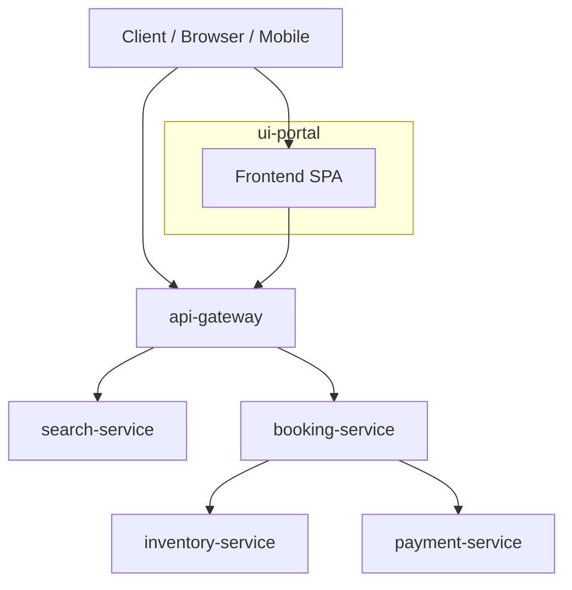

# Architecture Overview — travel-sre-ai-platform

## 1. High-Level System Architecture

The platform is a Kubernetes-native, microservices-based travel booking system.  
All services communicate internally using ClusterIP Services, with the API Gateway acting as the only public entrypoint.

Mermaid (paste this into a ```mermaid block inside your repo):



### Responsibilities

api-gateway  
- Public entrypoint  
- Routes search + booking requests  
- Exposes /metrics  

search-service  
- Flight + hotel search  
- Endpoints: /search/flights, /search/hotels  

booking-service  
- Orchestrates booking flows  
- Calls inventory-service + payment-service  

inventory-service  
- Manages seat/room availability  
- Reserve + release endpoints  

payment-service  
- Simulates payment authorization  

---

## 2. SRE / AI Components

The platform includes a full observability and reliability stack:

[Kubernetes Cluster]  
   ├── Microservices (6 total)  
   ├── Observability Stack  
   │     ├── Prometheus (metrics)  
   │     ├── Grafana (dashboards)  
   │     ├── Loki (logs)  
   │     └── Promtail (log shipping)  
   └── AI SRE Agent  
         ├── Worker loop  
         ├── /metrics endpoint  
         ├── /analyze/incident API  
         ├── /remediate webhook for Alertmanager  
         └── Slack integration  

### Observability Features

- ServiceMonitor for each microservice  
- PrometheusRule for:  
  - service alerts  
  - SLO burn-rate alerts  
  - latency + availability recording rules  

- Grafana dashboards (stored in ConfigMaps):  
  - Platform Overview  
  - AI SRE Agent Dashboard  
  - AI SRE Agent SLO Dashboard  
  - Service Template Dashboard  

- Loki + Promtail for log aggregation
  
---

## 3. Deployment Model

### Namespaces

Platform services:

namespace: platform

Observability stack:

namespace: observability

### Service Exposure

| Service            | Type       | Port | Exposed? |
|-------------------|------------|------|----------|
| api-gateway       | NodePort   | 3000 | Yes      |
| search-service    | ClusterIP  | 3001 | No       |
| inventory-service | ClusterIP  | 3002 | No       |
| payment-service   | ClusterIP  | 3003 | No       |
| booking-service   | ClusterIP  | 3004 | No       |
| ai-sre-agent      | ClusterIP  | 3005 | No       |
| ui-portal         | ClusterIP  | 3006 | No       |

---

## 4. GitOps Architecture (ArgoCD)

The entire platform is deployed using ArgoCD ApplicationSet:

infra/argocd/applicationset-platform.yaml

### GitOps Features

- Automatically deploys all services  
- Syncs environments: dev, develop, preprod, main  
- Ensures declarative, versioned infrastructure  
- Watches the repo for changes and applies them automatically  

---

## 5. AI SRE Agent Architecture

The AI SRE Agent is a Kubernetes‑native reliability automation component.

### Responsibilities

- Processes anomaly detection jobs  
- Exposes Prometheus metrics  
- Provides /analyze/incident for debugging  
- Receives Alertmanager webhook via /remediate  
- Executes auto‑remediation actions:  
  - Restart itself  
  - Scale to 2 replicas  
  - Scale to 3 replicas  
  - Escalate to humans via Slack  

### Metrics

- jobs_processed_total  
- job_duration_seconds_bucket  
- job_duration_seconds_sum  
- job_duration_seconds_count  

These power:

- Availability SLO  
- Latency SLO  
- Error budgets  
- Burn‑rate alerts  
- Grafana dashboards  

---

## 6. UI Portal Architecture

The ui-portal is a frontend SPA that consumes:

- api-gateway (search + booking)  
- ai-sre-agent (incident analysis)  
- Prometheus/Grafana dashboards (via gateway or internal routing)  

### UI Features

- Service health visualization  
- SLO + error budget dashboards  
- Deployment version display (image tags)  
- Incident analysis viewer  

---

## 7. Future Enhancements

- Synthetic monitoring (Blackbox exporter)  
- Auto-remediation workflows expansion  
- Distributed tracing (Tempo)  
- Chaos engineering  
- Multi-region deployment  

---

This document reflects the final architecture of the platform, aligned with the repo structure, GitOps model, observability stack, and AI SRE Agent capabilities.
